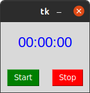
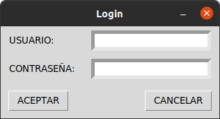
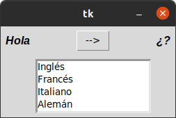
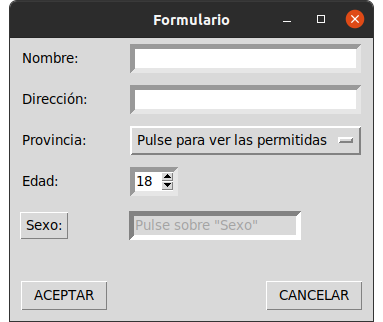
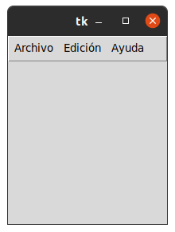
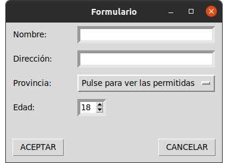
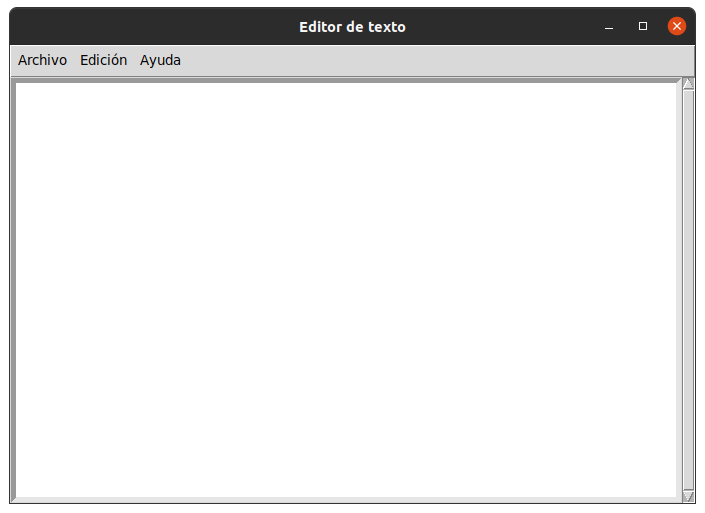
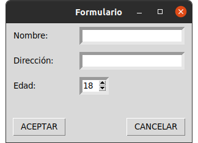
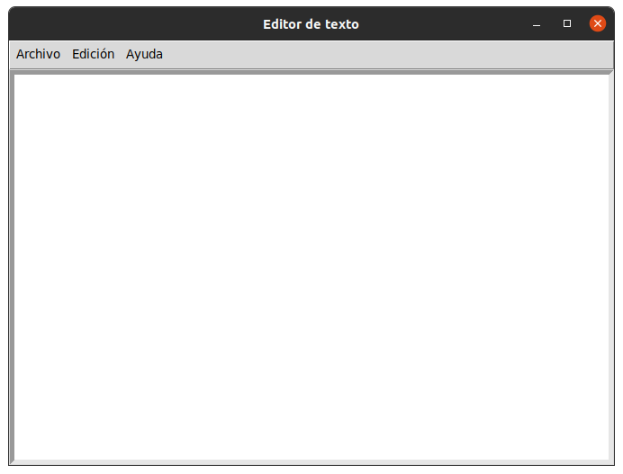
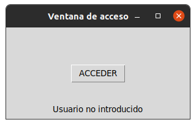

### ejercicio_5_widgests
## button
### esto nos sirve para medir tiempo es como un cronometro

## entry
### esto nos sirve para poner un usuario y una contraseña

## label_reloj
### esto nos sirve para ver la hora exacta

## listbox
### esto nos sirve para traducir palabras a 4 diferentes paises

## menu
### esto es un menu con diferentes opciones utiles

## menubutton
### esto es un formulario donde nos piden dar un nombre direccion sexo edad 

## messagebox
### es un menu desplegable que nos da muchas opciones

## optionmenu
### es un menu que nos pide dar diferentes datos como la edad,la provincia,el nombre

## scale_arco
### esto nos sirve para medir un angulo segun los grados dados

## scroll
### esto es otro menu mas grande tambien con varias opciones

## spinbox
### esto es un formulario con menos opciones que los anteriores

## text
### esto es un menu muy parecido a los anteriores

## toplevel
### es un menu que nos da un formulario que al dar click en acceder nos manda a una ventana donde hay un formulario para poner algunos datos
